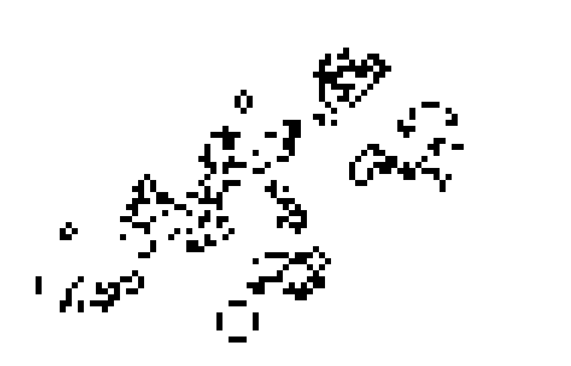

# 🧬 Conway's Game of Life — C# + Raylib

### 🎮 Overview

This project is a graphical simulation of **Conway’s Game of Life**, implemented in C# using the *Raylib* graphics library.

It allows you to:

- Draw and erase cells with the mouse

- Pause and resume the simulation

- Step forward one generation at a time

- Adjust simulation speed

- Clear the board

- Enjoy smooth visuals powered by Raylib

This project is perfect for learning *cellular automata*, *game loops*, and *interactive rendering in C#*.

### 🛠️ Technologies Used

- C# / .NET

- Raylib-cs (C# bindings for Raylib)

- Basic game loop architecture

- Efficient 2D array state transitions

### 📐 How It Works

The simulation follows Conway’s *four classic rules*:

1. Any live cell with fewer than 2 live neighbors dies.

2. Any live cell with 2–3 live neighbors survives.

3. Any dead cell with exactly 3 neighbors becomes alive.

4. All other cells remain dead.

The implementation updates the board each frame or *tick*, applying these rules to create evolving patterns.

### 📸 Screenshot

